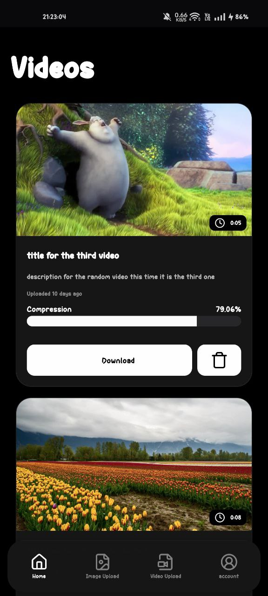
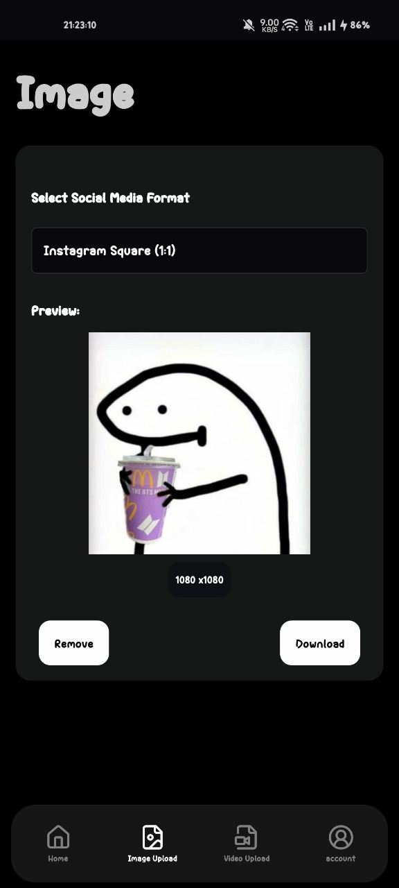
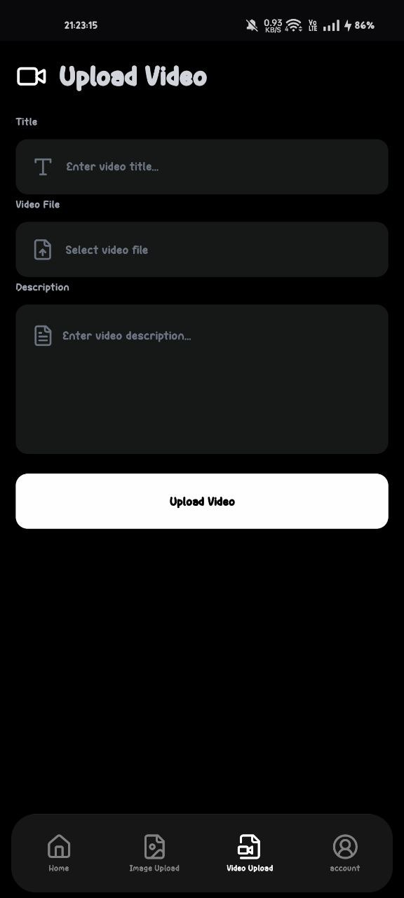
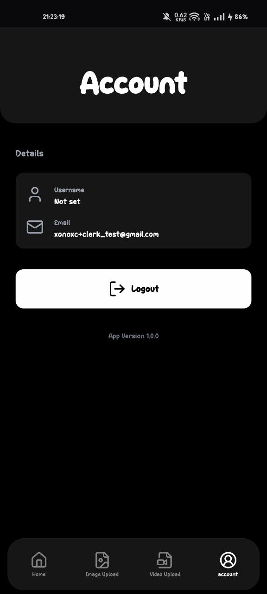

# Cclip Native

Native application for [cclip](https://github.com/xonoxc/cclip.git).


## Features

- Video Compression
- Image Social media formats adjustments
- Video Uploads
- Video Listing with stats.


## Tech Stack

**Client:** React-Native, Nativewind, Cloudinary , Prisma , Clerk.

**Server:** Expo API Routes.


## Screenshots












## Getting Started

Follow these steps to set up and run the project locally:

### 1. Clone the Repository

```bash
# Clone the repository
git clone https://github.com/xonoxc/cclip_native.git
cd cclip_native
```

### 2. Install Dependencies

Install all required dependencies using `bun` 

```bash
bun install

```

### 3. Configure Environment Variables

Create a `.env` file and copy `.env.sample` in it .

### 4. Set Up Database

After adding DatabaseURL in .env select the provider in `prisma.schema` file and generate the client :

```bash
 bunx prisma generate
```

> Ensure that the `DATABASE_URL` in `.env` is correctly configured.

### 5. Run the Development Server

the application using following command:

```bash
    bunx expo start --tunnel 

    #or with cache cleared

    bunx expo start --tunnel -c
```

Scan qr code to see application in Expo go mobile app or press `a` for opening the application in android emulator or `i` for ios simulator.

